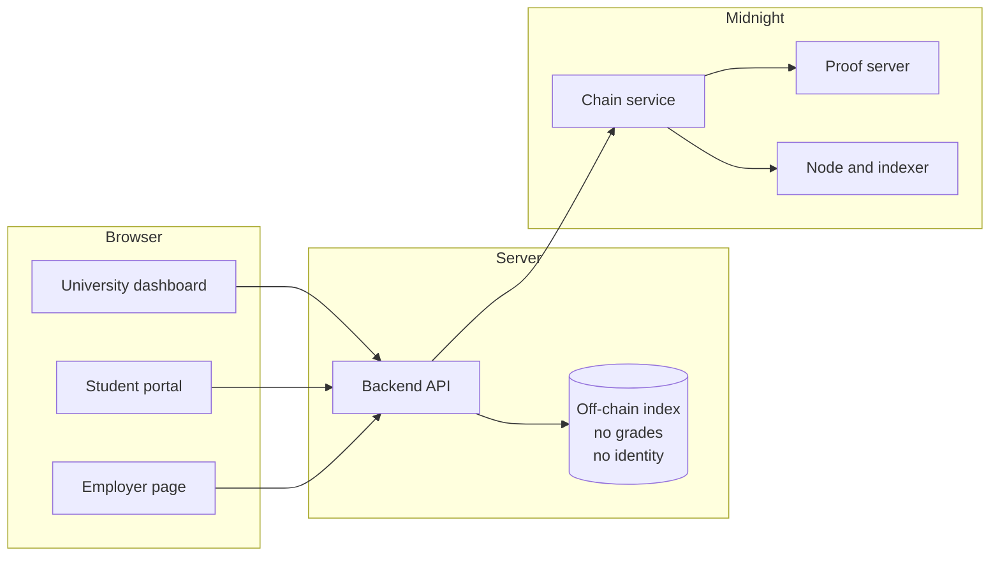
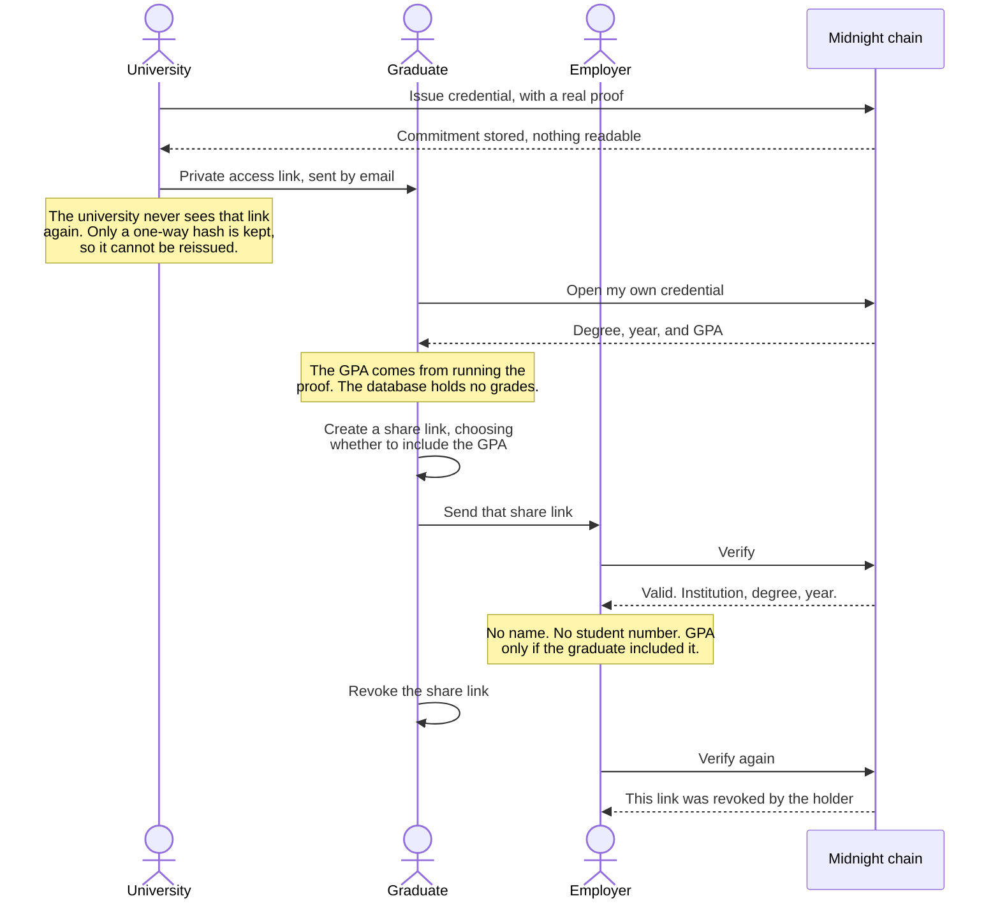
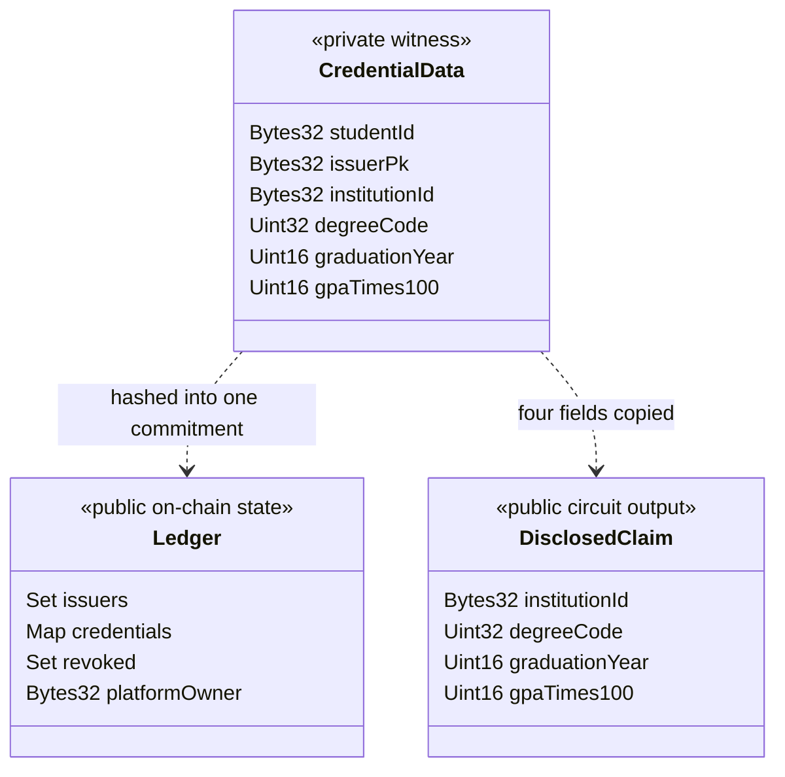
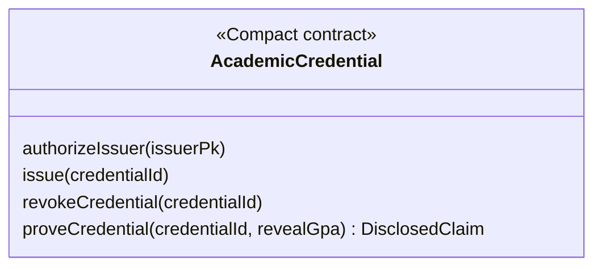
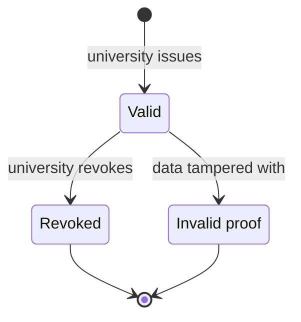

# AcadVerify

**Privacy-preserving academic credential verification on [Midnight](https://midnight.network/)**

A university issues a degree. The graduate decides who sees what. An employer
checks it in about a tenth of a second, and learns only what the graduate chose
to share.

Nothing about the student goes on the chain. Not their name, not their student
number, not their grades, not even a hash of any of it. And a forged credential
is not *caught* after the fact. It simply **cannot produce a proof at all**.

Built for the MLH Midnight Hackathon, August 28 to 30, 2026. Track: Beginner Track.

---

## Contents

- [The problem](#the-problem)
- [How it works](#how-it-works)
- [The three people involved](#the-three-people-involved)
- [What the contract actually stores](#what-the-contract-actually-stores)
- [The privacy guarantee](#the-privacy-guarantee)
- [Credential lifecycle](#credential-lifecycle)
- [Features](#features)
- [Quick start](#quick-start)
- [Evidence](#evidence)
- [Limitations](#limitations)
- [Documentation](#documentation)

---

## The problem

Verifying a degree today means one of two bad options.

**Option one: send the whole document.** A candidate emails a PDF transcript to
an employer. To prove they hold a computer science degree, they also hand over
their student number, every grade they ever received, and their date of birth.
The employer keeps that file. So does their applicant tracking system.

**Option two: call the university.** Slow, manual, and it only works while the
university still exists and still answers the phone.

Both leak far more than the question required. The question was "does this
person hold this degree". The answer given is an entire academic history.

---

## How it works

Three separate pieces of software, each with a different job.



What matters is what each store is allowed to hold.

The **chain** holds a commitment: one scrambled value per credential. You cannot
read a degree out of it, and you cannot guess your way back to one, because a
random secret is mixed in before scrambling.

The **off-chain index** holds a credential id, an institution name, and a degree
title. It deliberately holds **no grades and no student identity**. That is why
the student portal has to run a real proof to show a graduate their own GPA. The
server genuinely does not know it.

---

## The three people involved

This is the whole product in one picture. Read it top to bottom.



The point that matters: **the employer has no way to ask for more.** There is no
toggle on the verification page, no query parameter, no request button.
Disclosure is created by the graduate, or it does not happen.

An earlier version of this project got that wrong. The verification page had a
"show GPA" button any visitor could click. That is not consent. It was removed.

---

## What the contract actually stores

This is the core of the privacy design.



Compare the two structures carefully.

`CredentialData` is the full credential. It is a **witness**, which in Midnight
means a private input to the proof. It is never written to the chain and never
appears in the public transaction.

`DisclosedClaim` is what a verification returns. It has **four fields, and
`studentId` is not one of them.**

That absence is the entire design. Hiding the student's identity is not a
runtime check somebody could forget to write, and not a setting an administrator
could misconfigure. There is no field to put it in. The type system makes
disclosing the holder's identity **impossible to express**.

### The four circuits



| Circuit | Who calls it | What it checks |
|---|---|---|
| `authorizeIssuer` | Platform owner | The caller really is the platform owner |
| `issue` | University | The issuer is authorized, and the credential is bound to the key signing it |
| `revokeCredential` | University | The issuer is authorized and owns this credential |
| `proveCredential` | Anyone verifying | The credential exists, the commitment matches, it is not revoked, the issuer is authorized |

`proveCredential` is the interesting one. It asserts four things at once. In a
zero-knowledge circuit, an `assert` that fails does not raise an error somebody
can catch. **No proof exists.** There is nothing to submit and nothing to show.

---

## The privacy guarantee

Midnight's Compact compiler tracks which values came from a witness, and refuses
to compile if one of them reaches public output without passing through an
explicit `disclose()`.

A privacy leak in this contract is therefore **a build failure**, not a bug
somebody might catch in review. The guarantee is enforced by the compiler, not
by anyone's discipline.

The contract uses:

- **3 witnesses** (`localSecretKey`, `credentialFields`, `credentialSalt`),
  private inputs to the proof that are never published
- **15 explicit `disclose()` calls**, each a deliberate and reviewable decision
  that one specific value may become public
- **A fresh random salt for every credential**, so two identical degrees produce
  completely different commitments, and nobody can work backwards from a
  commitment by guessing common values

### What this replaced

The project began as a conventional Ethereum-style design. Moving to Midnight
did not merely change the chain. It changed what a verification reveals.

| | Before, on Ethereum | After, on Midnight |
|---|---|---|
| Stored per credential | Document hash, issuer address, metadata link | One blinded commitment |
| The verifier learns | Every field in the document | Only the fields the graduate chose |
| A forged credential | Detected afterwards by comparing hashes | Cannot be proven at all |
| Brute-force risk | Real. Few possible degrees, and the salt was printed in the QR code | None. The salt never leaves private state |
| Erasure | The hash stays public forever | Delete the salt and the commitment can never be opened |

---

## Credential lifecycle



A verification always returns exactly one of three states, and the difference
between the last two matters.

**Valid** discloses only what a share link created by the holder allows.
**Revoked** means a real credential the university withdrew. **Invalid proof**
means the data no longer matches what was committed, and the proof cannot be
produced at all.

The system never reports one as the other. Accusing a real graduate of forgery
is a serious thing to get wrong.

---

## Features

### For the university

Issue a degree, and alongside it attest anything else the university can vouch
for: individual courses and their grades, honors, extracurriculars,
certifications, research.

**Each attestation becomes its own credential on the chain**, with its own
commitment, its own random salt, and its own share links. That is deliberate. It
lets a graduate prove they took one specific course to one specific employer
without revealing the rest of their transcript.

Revoking a degree does not revoke the courses. They were still taken.

### For the graduate

A private page at `/hold/<secret-link>`. No account, no password, nothing to
lose and nothing for the server to store. The link is the key.

That link travels in an HTTP header, never in the address bar path, because
server access logs record paths.

From this page the graduate creates one share link per employer, chooses whether
each one includes the grade, and can revoke any of them at any time.

### The resume checker

Paste a resume. An AI model reads it and extracts the education claims it makes.
Then a **plain, deterministic comparison** checks each claim against what the
credential actually proves. The model never decides whether anything is true. It
only reads.

Each claim comes back as **proven**, **contradicted**, or **unproven**. A
mismatched institution is reported as unproven rather than contradicted, because
a graduate may well hold other qualifications this credential cannot speak to.

Before anything is sent, the text is shown again with emails and phone numbers
already removed, in a box the student can edit. A privacy product that quietly
shipped a resume to a third party would be arguing against itself.

---

## Quick start

```bash
# 1. Node 22 or newer, which Midnight requires
nvm install 22

# 2. The Compact toolchain
curl --proto '=https' --tlsv1.2 -LsSf \
  https://github.com/midnightntwrk/compact/releases/latest/download/compact-installer.sh | sh
source ~/.zshrc && compact update

# 3. Bring up the local stack: Midnight node, indexer and proof server,
#    plus DynamoDB and MinIO
cp .env.example .env
docker compose up -d

# 4. Compile the contract
cd midnight/chain-service && npm run compact
# prints: Compiling 4 circuits

# 5. Deploy to the local devnet, then point the stack at it
npm run deploy                 # writes midnight/deployments/undeployed.json
# copy contractAddress into CONTRACT_ADDRESS in .env, and set CHAIN_MODE=live
docker compose up -d --force-recreate chain-service backend
```

If live mode starts but never begins listening, and the log stays empty apart
from RPC noise, the address in `CONTRACT_ADDRESS` is not on the chain.
Restarting the node starts a fresh chain and erases earlier deployments, so run
`npm run deploy` again.

Editing `.env` requires `docker compose up -d --force-recreate`. A plain
`restart` keeps the container's original environment.

### Run the tests

```bash
cd midnight/chain-service && npm test    # 66 tests, 9 files
npm run smoke                            # end to end against the devnet
npm run check:salt-leak                  # the salt never appears in a response or log

cd ../../backend && pytest               # 121 tests
cd ../frontend && npx playwright test    # 4 browser tests
```

Setup notes and troubleshooting: [docs/local-setup.md](docs/local-setup.md).

---

## Evidence

Verified on the local devnet between 2026-08-28 and 2026-08-30.

| Claim | How it was checked |
|---|---|
| The contract compiles | `npm run compact` produces 4 circuits, prover and verifier keys, ZKIR, and a TypeScript API |
| Selective disclosure is real | `proveCredential` returns 4 fields, and `studentId` is absent from the type itself |
| The proofs are genuine | Runs against a deployed contract rather than a mock. Issuing takes about 25 seconds, and the proof server saturates 6 CPU cores while it works |
| A forged credential is unprovable | A debug endpoint alters the witness data. Verification then reports invalid proof, never valid |
| The salt never leaks | `check:salt-leak` inspects every response and log line from a real issuance |
| Automated tests | 121 backend, 66 chain service, 4 browser |

Measured on the local devnet: issuing takes about 25 seconds, revoking about 20.
Almost all of that is waiting for blocks, which are produced every 6 seconds.
Generating the proof itself takes roughly 2 seconds. Every read, including
verification and the student portal, answers in about 0.1 seconds.

---

## Limitations

Stated plainly, because a privacy claim with hidden caveats is not a privacy
claim.

- **The credential id is visible to whoever verifies it.** Someone holding a
  link can therefore tell the same credential was checked twice. We do not claim
  unlinkability. A possible fix is sketched in
  [docs/smart-contract.md](docs/smart-contract.md).
- **Runs on the local devnet.** Not yet deployed to a public Midnight network,
  which needs faucet funds.
- **A share link that includes the grade, created on an attestation with no
  grade recorded, shows 0.00 to the employer.** The chain has no way to
  represent "no grade recorded", so it stores zero. The student portal hides
  that button and reads the value as absent, but a hand-made link can still
  reach it.
- **Attestations are issued one after another**, roughly 25 seconds each, which
  is why one request is capped at 10 of them.
- **The resume checker compares against the degree only**, not the attestations.
- **An access link cannot be resent.** The student's email address is used once
  and discarded, and the server keeps only a one-way hash of the link itself. A
  lost link means issuing a new credential.
- **Share links live in a JSON file with no locking.** Fine for a demo, not for
  production.
- **The wallet identifies the university and nothing more.** It is never asked
  to sign. The chain service holds the issuing keys.
- **The detachable proof bundle was attempted and cut for time.** See
  `midnight/chain-service/README.md`.

---

## Documentation

| Document | Contents |
|---|---|
| [Midnight Stack](docs/midnight-stack.md) | Start here. Verified versions, endpoints, components |
| [Local Setup](docs/local-setup.md) | Getting it running, and what to do when it breaks |
| [Architecture](docs/architecture.md) | System design and trust model |
| [Midnight Integration](docs/midnight-integration.md) | What we use from Midnight, and why |
| [Smart Contract](docs/smart-contract.md) | The Compact contract and its privacy trade-offs |
| [Data Model](docs/data-model.md) | Commitments, witnesses, and what may never go on-chain |
| [API Specification](docs/api-spec.md) | Endpoints, verification states, error semantics |
| [Deployment](docs/deployment.md) | Proof server operations, private state, CI |
| [Hackathon Plan](docs/hackathon-plan.md) | Roadmap, demo storyline, risks |
| [Team Roles](docs/roles/) | Ownership per role |

---

## Repository layout

```
acadverify/
  midnight/
    contracts/academic_credential.compact   the Compact contract
    chain-service/                          Node 22 and Midnight.js
    deployments/                            contract address per network
  backend/                                  FastAPI
  frontend/                                 Next.js
  infrastructure/                           Terraform, Docker, Kubernetes
  docs/
  scripts/
```

## Stack

**Chain and privacy.** Compact 0.31.1 (language 0.23.0, runtime 0.16.0), the
Midnight proof server, and the Midnight node with its GraphQL indexer.

**Chain service.** Node 22, TypeScript, Midnight.js SDK 4.1.1.

**Backend.** FastAPI, DynamoDB, S3.

**Frontend.** Next.js, React, TypeScript, Tailwind CSS, and the Midnight DApp
connector for the Lace wallet.

**Operations.** Docker, AWS ECS Fargate, Terraform, GitHub Actions, Trivy.

There is no Solidity, Hardhat, or Ethereum tooling in the main path. Midnight is
not EVM-compatible, and Midnight.js has no Python bindings.

---

## Contributing

Six people share this repository, so every branch carries its owner's name.

```bash
git checkout -b yourname-area
git push -u origin yourname-area
```

---

## Prior work disclosure

The *concept*, and an Ethereum-based design that anchored SHA-256 hashes on
Polygon, predate this event. **Every line of code in this repository was written
during the hackathon**, first commit 2026-08-28. Nothing from the earlier
prototype is reused, because Midnight is not EVM-compatible and the privacy
model is fundamentally different.

## License

MIT.

## Acknowledgements

Built with [Midnight](https://docs.midnight.network/), Compact, Midnight.js,
Next.js, FastAPI, AWS, Terraform, Docker, and GitHub Actions.
